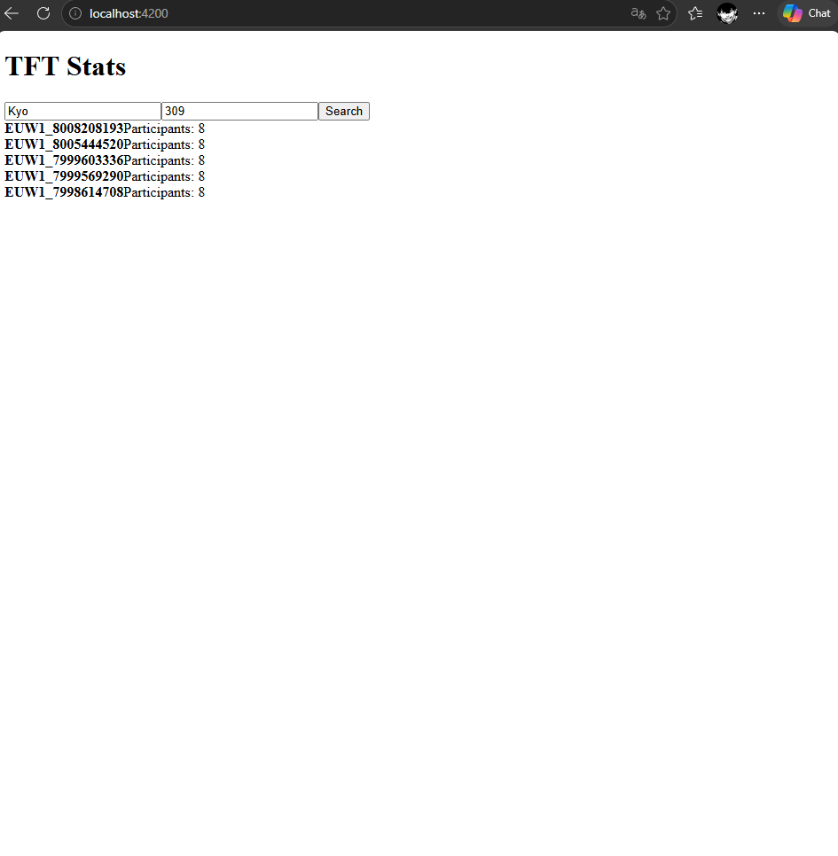

## How to run
1. Get an API key at developer.riotgames.com
2. Backend (PowerShell):
   `$env:RIOT_API_KEY="your-key"; cd backend; .\mvnw.cmd spring-boot:run`
   (Linux/macOS: `export RIOT_API_KEY=... && cd backend && ./mvnw spring-boot:run`)
3. Frontend: `cd frontend && npm install && ng serve`
4. Open http://localhost:4200

## DISCLAIMER
"tft-stats" isn't endorsed by Riot Games and doesn't reflect the views or opinions of Riot Games or anyone officially involved in producing or managing Riot Games properties. Riot Games, and all associated properties are trademarks or registered trademarks of Riot Games, Inc.
